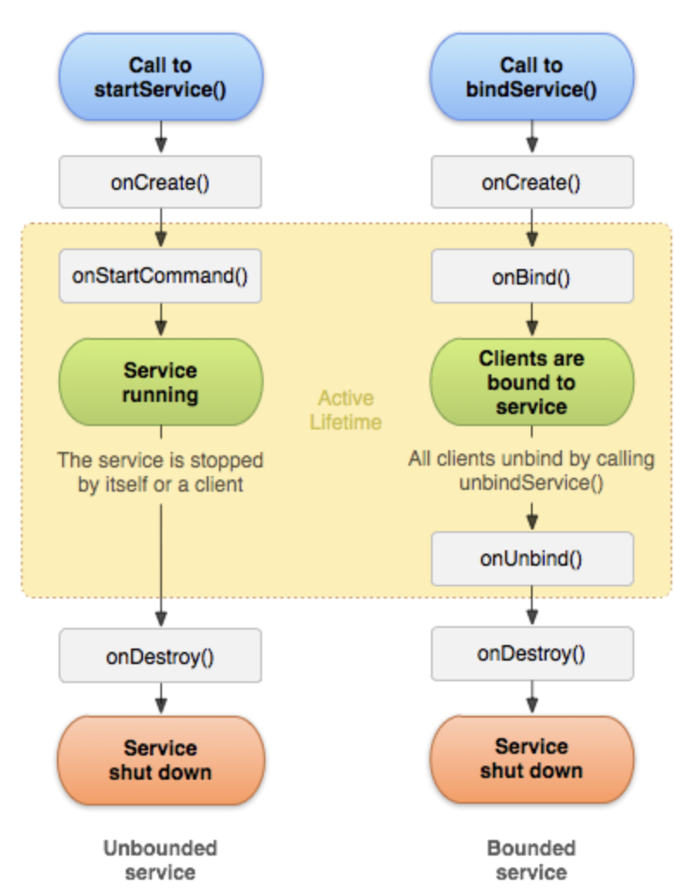
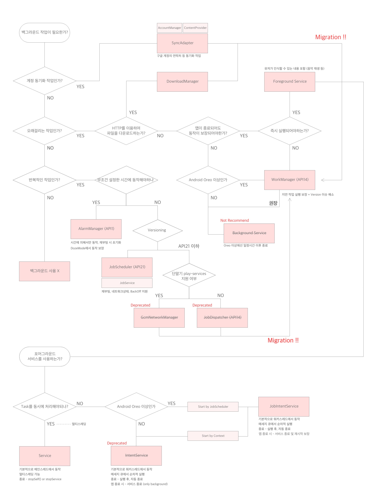

# Background Tasks

## 개념
프로세스에는 `포어그라운드`와 `백그라운드`가 존재한다. 이 때 유저와 상호작용하고 있는 녀석을 `포어그라운드`라 하며, 상호작용하지 않지만 뒤에서 특정 로직을 수행하는 녀석을 `백그라운드`라 칭한다. <b>Background Tasks</b>는 사용자와 상호작용하고 있진 않지만, 종료되지않고 계속 실행되는 작업을 지칭한다.

## 주요 요소
- Service
    - Service
    - IntentService
    - JobService
    - JobIntentService
- JobScheduler
- WorkManager
- AlarmManager

## Service
### 개념
    Service는 오래걸리는 작업을 백그라운드에서 수행할 수 있는 안드로이드의 컴포넌트이다.

### Service vs Thread
    Q : Thread도 오래걸리는 작업을 수행하기 위해서 비동기적 처리하기 위해 존재하는 거 아닌가요?

    A : 많은 글에서 Thread와 Service를 비교합니다. 하지만 이 둘은 비교 대상이 아닙니다. Service는 어플리케이션 내에서 유저와 상호작용하지 않는 백그라운드 로직을 담당하며 내부적으로 Thread를 사용합니다. 대부분 글에서 말하는 "Thread는 앱이 Foreground에서 사용되고 있을 때 백그라운드 작업을 수행합니다."는 단순히 Activity에서 Thread를 사용했기 때문입니다.

### Service vs IntentService
    Service는 기본적으로 추상클래스이며 상속을 통한 서브클래스를 이용하여 서비스를 실행시켜야합니다. Service는 기본적으로 메인스레드를 사용하기 때문에 ANR을 피하기 위해선 워커스레드를 생성하여 작업을 실행해야합니다. 또한 Service의 작업이 끝났을 때 stopSelf() 또는 stopService()를 호출하지 않으면 Service가 종료되지않으니 주의하세요.

    IntentService(Deprecated)는 Service를 상속받은 서브클래스로서, IntentService를 상속받아 구현하면 좀 더 쉽게 백그라운드 작업을 구현할 수 있습니다. 하지만 멀티스레드 환경이 필요하다면 Service를 확장하여 구현하는 것이 필수적입니다. IntentService는 기본적으로 워커스레드에서 작업을 실행하며, 작업이 끝나면 스스로 서비스를 종료합니다.

### JobService vs IntentService vs JobInentService
    JobService는 주기적인 백그라운드 작업과 관련이 있습니다. 단독으로 사용되지 않으며, JobScheduler와 함께 실행되는 콜백형태의 Service입니다.

    JobIntentService는 IntentService가 Deprecated되면서 나온 대체제입니다. JobScheduler를 사용할 수 있는 Lollipop(21) 이상에서는 JobScheduler.enqueue로 실행시키며, 미만에서는 Context.startService로 실행됩니다.

### Background Service vs Foreground Service vs Bind Service    
지금까지는 Service와 Service를 상속받는 서브클래스들을 살펴봤다면, 여기서는 서비스를 실행할 때, 어떠한 방법으로 실행할지를 결정합니다.

    Foreground -> 포어그라운드 서비스를 앱이 종료된 후에도 계속 사용하고 싶을 때 사용합니다. 사용자들이 포어그라운드가 실행 중임을 눈치챌 수 있도록 상태바에 올라와있으며, 음악 등을 재생하는데 사용합니다.

    Background -> 백그라운드 서비스는 이제 사용할 일이 없습니다. 앱을 종료했을 시, 종료될 뿐더러, Oreo(26) 이상에서는 DozeMode의 도입으로 인해 1분 이상 실행되면 강제종료됩니다.

    Bind -> 위의 두 Service 실행 방식은 단순한 실행이며, 서비스가 자신이 서비스를 종료할 수 있었습니다. 하지만 바인드 서비스는 다른 클라이언트 (앱컴포넌트)로 하여금 서비스가 바인딩된 형태이며, 바인딩 상태일 경우, 클라이언트와 지속적으로 상호작용할 수 있습니다. 또한 서비스는 자신 스스로 종료할 수 없으며, 클라이언트가 바인딩을 해제하면 비로소 종료됩니다.
 

    
    
[그림 1] 일반 서비스와 바인드 서비스의 생명주기

## JobScheduler
    JobScheduler는 Lollipop(21)부터 지원되며, 다양한 Job들의 스케쥴링을 지원하는 API입니다. 인스턴스화는 필요없으며 
    
    Context.getSystemService(Context.JOB_SCHEDULER_SERVICE) 로
    Context로부터 얻어와서 사용할 수 있습니다.

    JobInfo를 통해서 Job이 어떠한 방식으로 실행되는지를 결정하며, JobService릁 통해서 어떠한 동작을 실행할지를 결정합니다.

    DozeMode에 의해서 Job이 딜레이될 순 있지만 실행은 보장됩니다.

    Lollipop부터 지원되기때문에 버젼이슈에 대응하기 위해서 여러 다른 API들이 존재했지만, 모두 Deprecated됐으며 대안책으로는 WorkManager 사용을 권장합니다.

## AlarmManager
    시스템 알람 서비스를 사용할 수 있는 클래스입니다. SDK1부터 지원되기떄문에 버젼 이슈가 없습니다. 단말기를 재부팅하면 지정되었던 알람은 삭제되지만, DozeMode가 활성된 시점에서도 딜레이되지 않고, 사용자가 원하는 시간에 실행되는 것이 특징입니다.

## WorkManager
    WorkManager는 앱이 종료되거나 기기가 다시 시작되는 경우에도 안정적으로 실행되어야 하는 작업을 처리하기 위해 설계되었습니다. DozeMode 등에 의해서 딜레이될 순 있지만 실행은 보장됩니다. 또한 버전 이슈를 최소화하기 위해 내부적으로 설계를 했으며 대부분에 레거시를 커버할 수 있는 수준입니다.

    API 23 이상을 사용하는 기기에서는 JobScheduler를 사용하여 구현하며,
    API 14~22를 사용하는 기기에서는 BroadcastReceiver + AlarmManager 조합을 사용합니다.

    배터리 소모를 최소하기위해 백그라운드 작업이 힘든어진 현재 WorkManager는 모든 백그라운드 작업에 권장되는 라이브러리입니다.

## 각 요소들을 적재적소에 사용하기

### [구글이 말하는 백그라운드 작업할 때 언제 뭘 써야하는가](https://developer.android.com/guide/background?hl=ko)
 

    
    
[그림 2] 한판으로 정리하는 백그라운드 요소

## 그냥 WorkManager 쓰세요!
WorkManager는 가장 고수준이며, 버전이슈를 내부적으로 처리해주고, 언제든 실행을 보장합니다 🥳

## 물론 AlarmManager와 ForegroundService를 써야할 때도 있습니다!
- 무조건 지정한 시간에 동작해야하는 알람앱을 만들고싶으면 `AlarmManager`
- 계속 살아있으면서 앱의 종료를 막고싶으면 `ForegroundService`